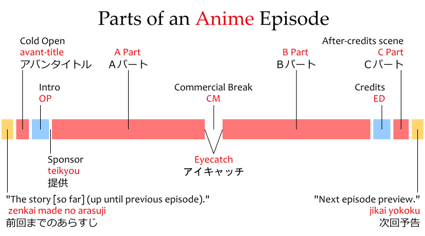
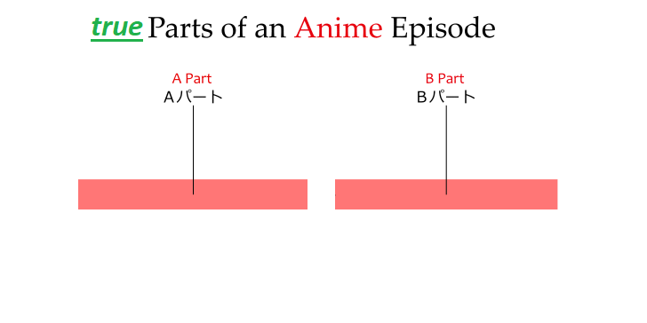

# ACOE : Anime cut openning & ending

[](https://forthebadge.com)


## The problem

I was tired of having to go through the openning of each episode of One Piece, as well as the engings.
On 20 minutes of episode, we have in reality only 15 minutes in the best cases.
So I want to save time by removing these "dead" parts

## Le principle
We have...

...and we want



### Prerequisites

```bash
apt install ffmpeg
apt install bc
apt install mkvmerge
```

> :warning: **only .mkv video are supported**

> :warning: **your videos must have chapters named "Part A" and "Part B"** 
> this is normally the default case

> :white_check_mark: **audio track and subtitles supported**

### Installation

1. download the "anime-coe.bash" on your linux, or your windows + WSL
2. create two folders : "in" and "out"
3. done

## How to use

1. Put all your videos in the "in" folder.
2. Open a linux shell, or a WSL shell in the local directory.
3. ```bash ./anime-coe.bash```
4. Enjoy all your parts in the "out" folder.
5. Use a program like "Mkvtoolnix" to merge all the output videos.

## Nexts steps

:white_check_mark: Working script

:white_large_square: Allow .mp4

:white_large_square: Allow the use of timescodes instead of chapters to split the video

:white_large_square: Friendly menu

:white_large_square: Dynamic